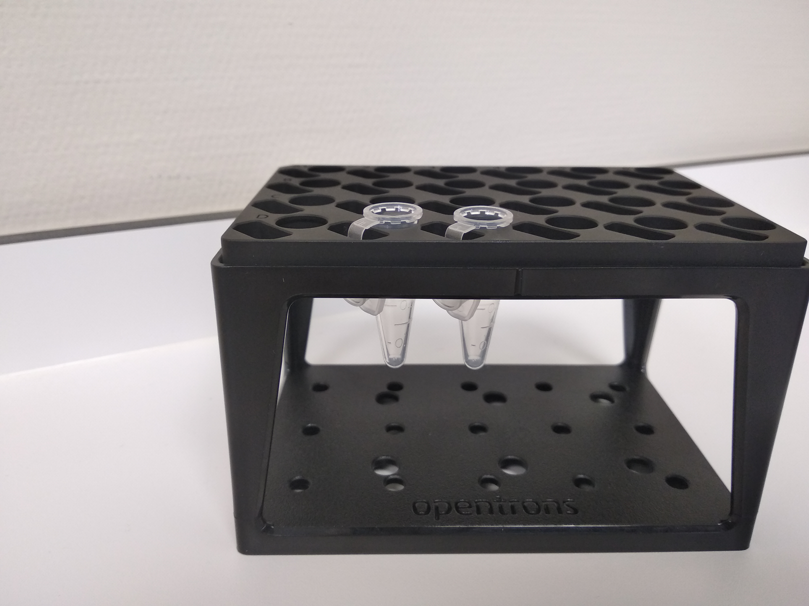
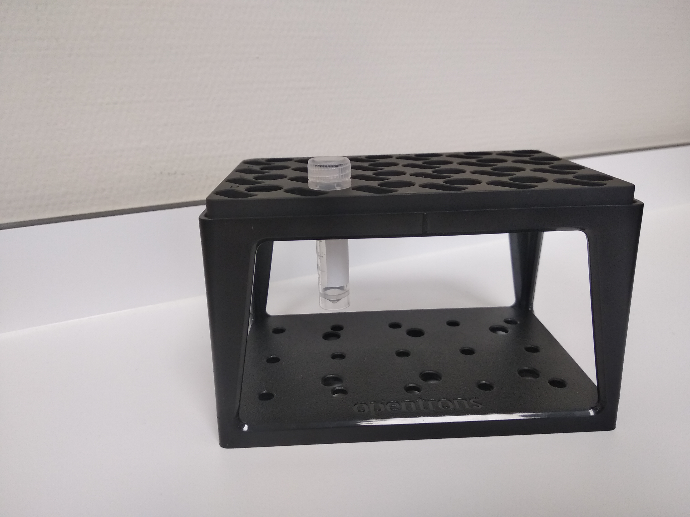
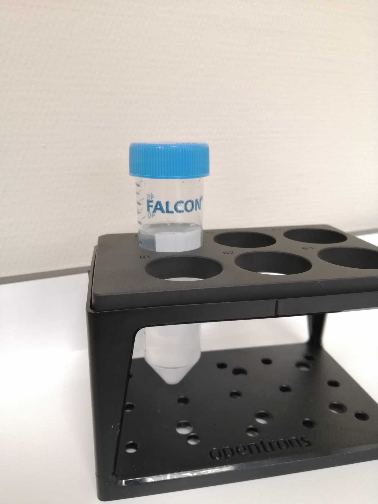
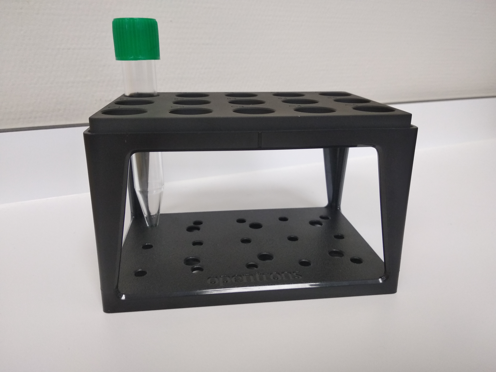
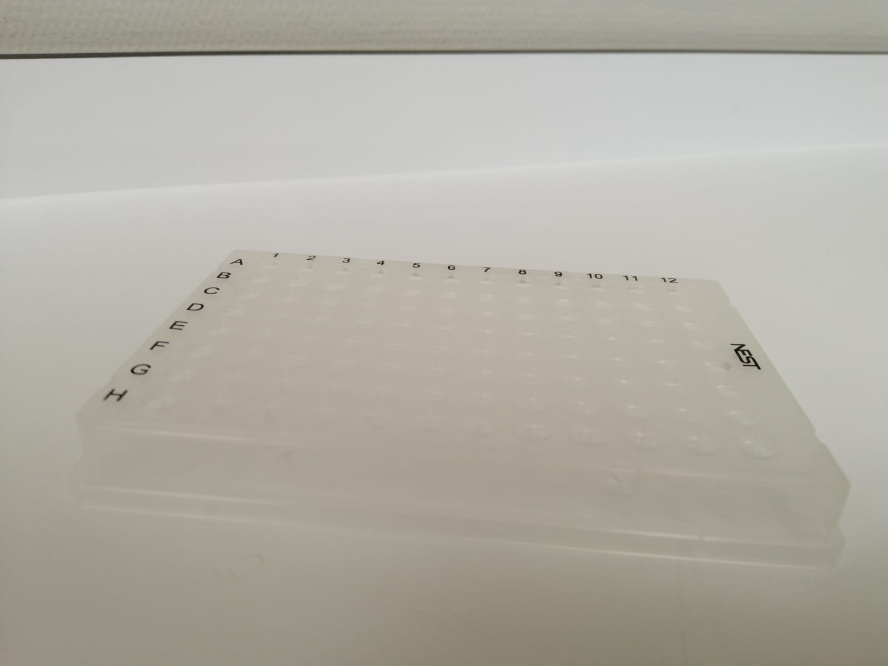
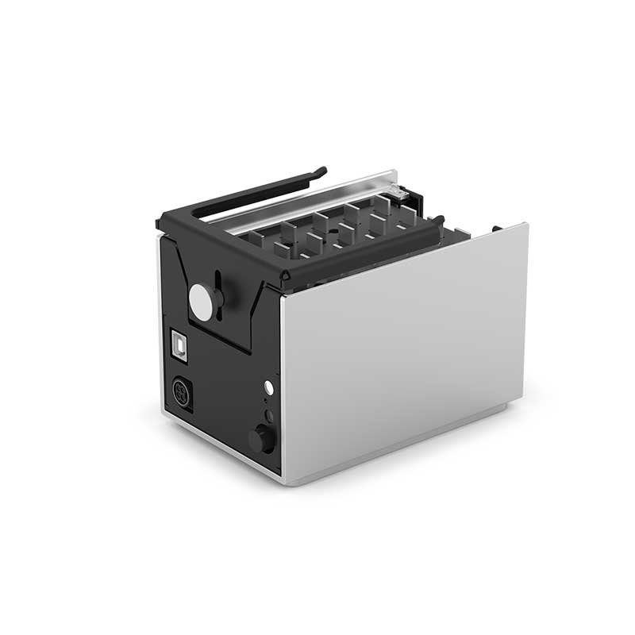
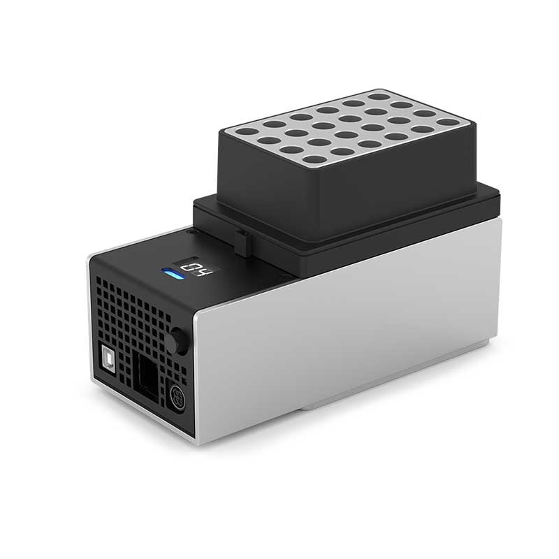

# Documentación labware
> por Luis Lorenzo Mosquera, Victor Soroña Pombo & Ismael Castiñeira Paz  
<pre>
      @@@@@    @@@@@
    @@@@          @@@@
   @@@      @@      @@@    @@@@@@   @@@@@
  @@@      @@@@      @@@   @@@@@@  @@@ @@@
  @@     @@@@@@@@    @@@     @@         @@
  @@    @@@    @@    @@@     @@        @@
  @@@    @      @    @@@     @@       @@
   @@@    @@@@@@    @@@      @@      @@
    @@@@          @@@@       @@     @@@@@@
      @@@@@@@@@@@@@@         @@    @@@@@@#
         @@@@@@@@
</pre>

# Tubos

  

## Tubo eppendorf  

  

* Capacidad: 1.5ml o 2ml
* Nomenclatura no técnica: ???
* Uso: muestras

  

## Criotubo  

  

* Capacidad: 2ml
* Nomenclatura no técnica: "de 2ml", de congelación
* Uso: muestras

  

## Tubo fondo redondo  

  

* Capacidad: 3ml
* Nomenclatura no técnica: "de 13x75"
* Uso: muestras

  

## Falcon 50ml  

  

* Capacidad: Hasta 50ml
* Nomenclatura no técnica: biberón
* Uso: buffer

  

## Falcon 15ml  

  

* Capacidad: 2ml
* Nomenclatura no técnica: "de tapa verde"
* Uso: ???

# Puntas

  

## Puntas para pipeta p1000  

  

* Capacidad: de 100µl a 1000µl
* Compatibles: Socorex®, Calibra/Acura®, VWR®, Matrix®, Nichiryo/Oxford®, Rainin®, Biohit®, Capp Aero®, Eppendorf®, Thermo®, Gilson®
* Load labware: *opentrons_96_filtertiprack_1000ul*

  

## Puntas para pipeta p300  

  

* Capacidad: de 100µl a 200µl  
* Compatibles: Socorex®, Calibra/Acura®, VWR®, Matrix®, Nichiryo/Oxford®, Rainin®, Biohit®, Capp Aero®, Eppendorf®, Thermo®, Gilson®
* Load labware: *opentrons_96_filtertiprack_300ul*

  

## Puntas para pipeta P20  

  

* Capacidad: de 10µl a 20µl
* Compatibles: Socorex®, Calibra/Acura®, VWR®, Matrix®, Nichiryo/Oxford®, Rainin®, Biohit®, Capp Aero®, Eppendorf®, Thermo®, Gilson®
* Load labware: *opentrons_96_filtertiprack_20ul*

# Deepwells

## Deepwell 195ml  

  

## Deepwell 15ml  

  

## Deepwell 2ml  

## PCR Plate  

# Racks

## Rack 96 (Aluminio)  

  

* Capacidad: 1 [pcr plate](#pcrplate)  
* Load labware: *abi_fast_qpcr_96_alum_opentrons_100ul*  

## Rack 24  

  

* Capacidad: 24 [tubos de fondo redondo](#f_redondo), [tubos eppendorf](#eppendorf) o [criotubos](#criotubo).
* Load labware: *opentrons_24_tuberack_generic_2ml_screwcap*

## Rack 24 (Aluminio)  

  

* Capacidad: 24 [tubos de fondo redondo](#f_redondo), [tubos eppendorf](#eppendorf) o [criotubos](#criotubo).
* Load labware: *opentrons_24_aluminumblock_generic_2ml_screwcap*

## Rack 15  

  

* Capacidad: 15 [falcon de 15ml](#falcon15).
* Load labware: *opentrons_15_tuberack_falcon_15ml_conical*

## Rack mixto  

  

* Capacidad: 4 [tubos falcon 50ml](#falcon50) y 6 [tubos falcon 15ml](#falcon15).
* Load labware: *opentrons_10_tuberack_nest_4x50ml_6x15ml_conical*

## Rack 6  

  

* Capacidad: 6 [tubos falcon 50ml](#falcon50).
* Load labware: *opentrons_6_tuberack_falcon_50ml_conical*

# Módulos

## Módulo magnético  

  

* Load labware: *magnetic module*

## Módulo de temperatura  

  

* Load labware: *temperature module gen2*
