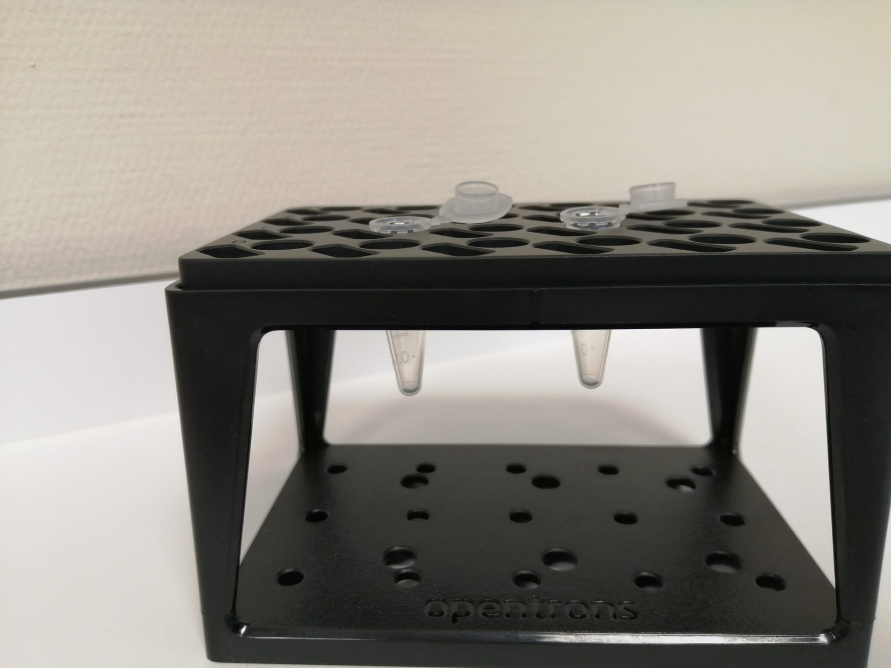
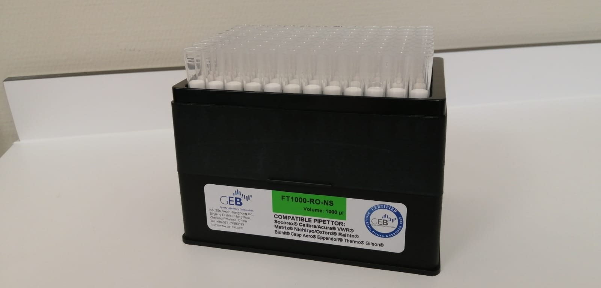
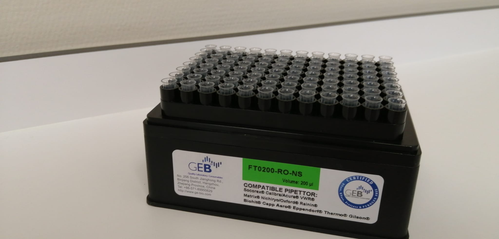
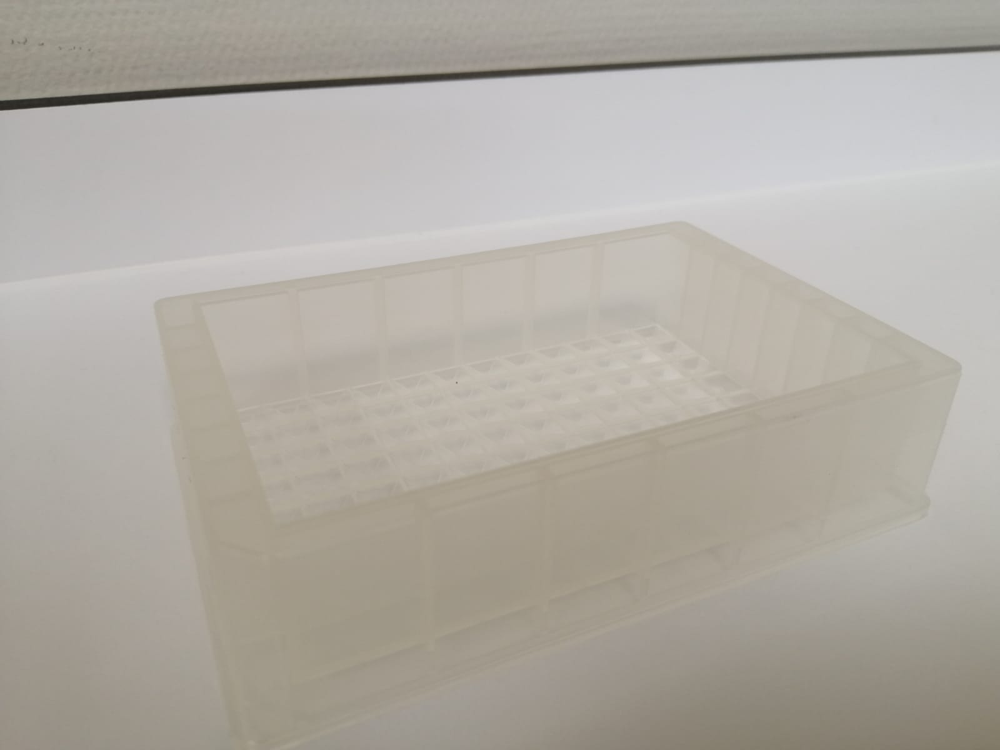
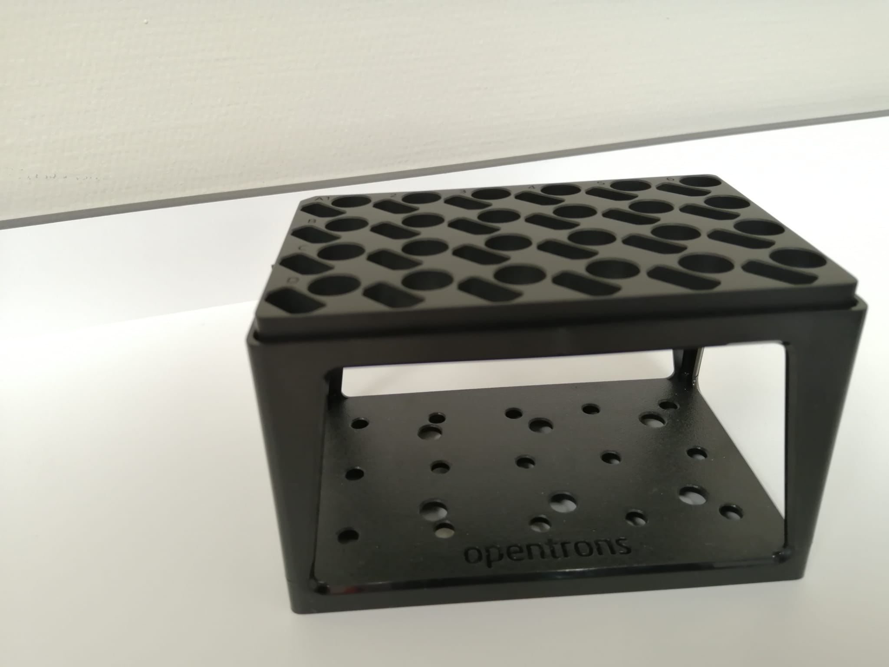
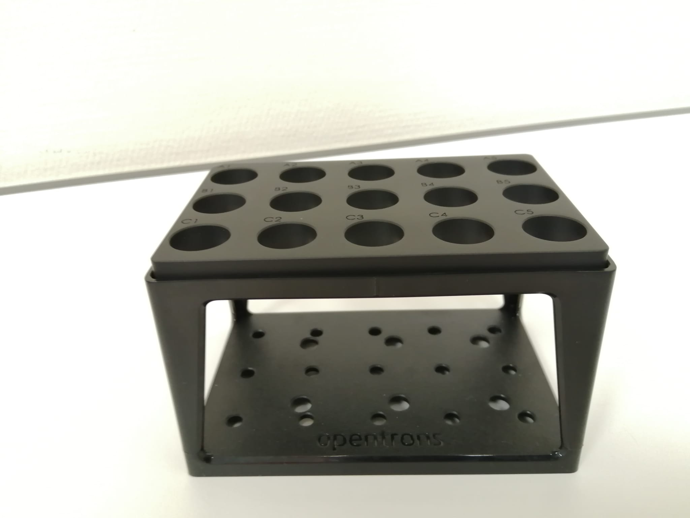
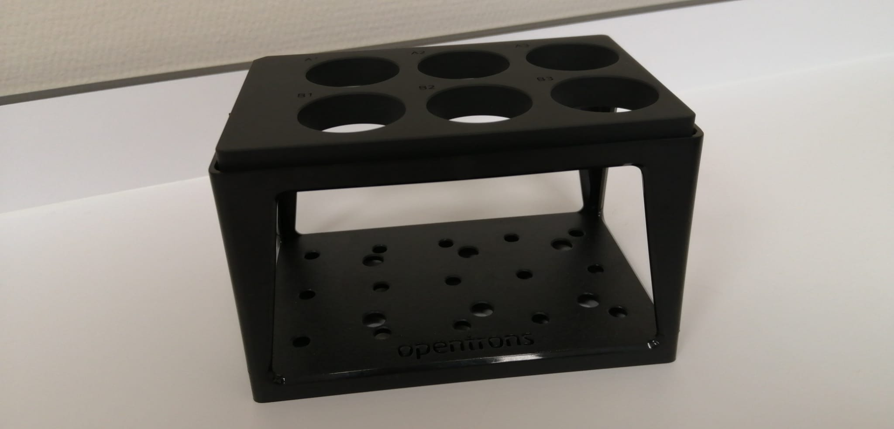

# Documentación labware
> por Luis Lorenzo Mosquera, Victor Soroña Pombo & Ismael Castiñeira Paz 
<pre>
      @@@@@    @@@@@                                                                               
    @@@@          @@@@                                                         
   @@@      @@      @@@    @@@@@@   @@@@@
  @@@      @@@@      @@@   @@@@@@  &amp;@&apos; &apos;@@
  @@     @@@@@@@@    &amp;@@     @@         @@
  @@    .@@@    @    #@@     @@        @@
  @@@    @      @    @@@     @@       @@
   @@@    @@..@@    @@@      @@      @@
    @@@@          @@@@       @@     @@@@@&amp;
      @@@@@@@@@@@@@@         ##    &amp;@@@@@#
         (@@@@@@.
</pre>

# Tubos

  

## Tubo ependor  

* Capacidad: 1.5ml o 2ml
* Nomenclatura no técnica: N/S
* Uso: muestras

  

## Criotubo 

* Capacidad: 2ml
* Nomenclatura no técnica: "de 2ml", de congelación
* Uso: muestras

  

## Tubo fondo redondo  

* Capacidad: 3ml
* Nomenclatura no técnica: "de 13x75"
* Uso: muestras

  

## Falcon  

* Capacidad: Hasta 50ml
* Nomenclatura no técnica: biberón
* Uso: buffer

# Puntas

  

## Puntas para pipeta p1000

* Capacidad: de 100µl a 1000µl

  

## Puntas para pipeta p300

* Capacidad: de 100µl a 200µl

  

## Puntas para pipeta P20

* Capacidad: de 10µl a 20µl

# Deepwell

## Deepwell 195ml

  

## Deepwell 15ml

  

## Deepwell 2ml

## Deepwell 0.1ml

# Rack

## Rack 96 (Aluminio)

* Capacidad: 96 N/S.

## Rack 24

* Capacidad: 24 [tubos de fondo redondo](#f_redondo), [tubos ependor](#ependor) o [criotubos](#criotubo).

## Rack 24 (Aluminio)

* Capacidad: 24 [tubos de fondo redondo](#f_redondo), [tubos ependor](#ependor) o [criotubos](#criotubo).

## Rack 15

* Capacidad: 15 N/S.

## Rack 4 + 6

* Capacidad: 4 [tubos falcon](#falcon) y  6 N/S.

## Rack 6

* Capacidad: 6 [tubos falcon](#falcon).

# Líquidos

~~~
TODO
~~~

# Módulos

## Módulo magnético
~~~
TODO
~~~

## Módulo de temperatura
~~~
TODO
~~~