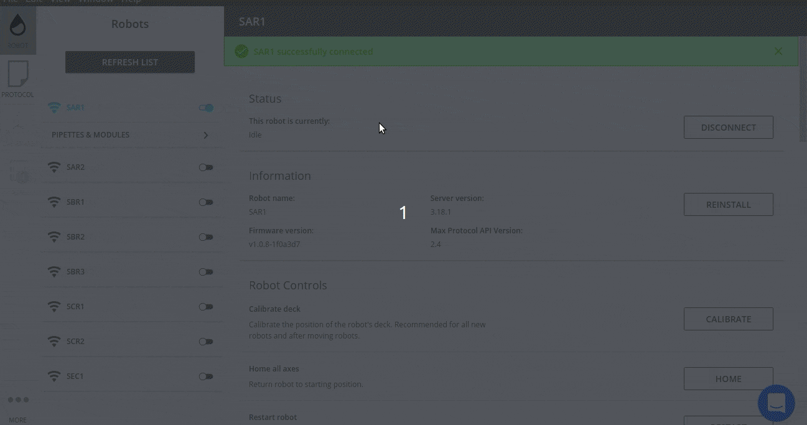
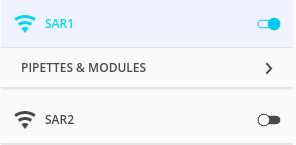
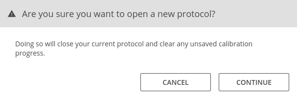
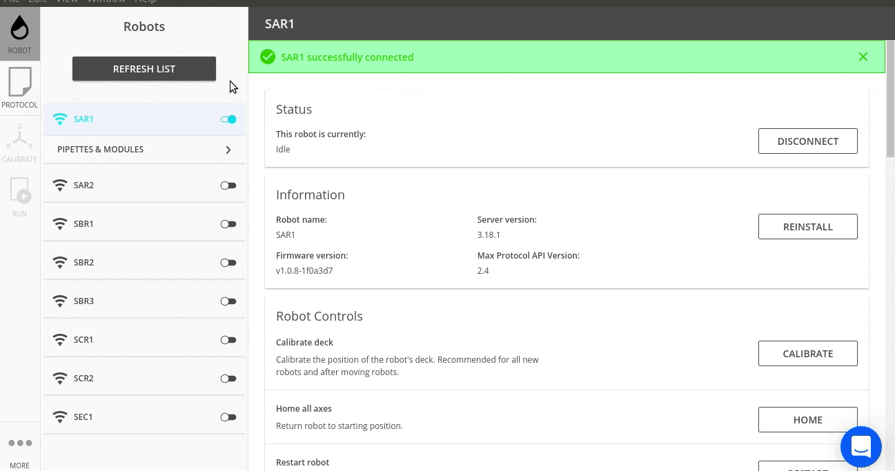

# Instrucciones para ejecutar los protocolos y manejo del programa
> por Luis Lorenzo Mosquera, Victor Soroña Pombo & Ismael Castiñeira Paz 
<pre>
      @@@@@    @@@@@                                                                               
    @@@@          @@@@                                                         
   @@@      @@      @@@    @@@@@@   @@@@@
  @@@      @@@@      @@@   @@@@@@  &amp;@&apos; &apos;@@
  @@     @@@@@@@@    &amp;@@     @@         @@
  @@    .@@@    @    #@@     @@        @@
  @@@    @      @    @@@     @@       @@
   @@@    @@..@@    @@@      @@      @@
    @@@@          @@@@       @@     @@@@@&amp;
      @@@@@@@@@@@@@@         ##    &amp;@@@@@#
         (@@@@@@.
</pre>

:warning: **IMPORTANTÍSIMO:** ANTES DE CARGAR NINGÚN PROTOCOLO ES IMPORTANTE TENER EL LABWARE COLOCADO EN SU CORRESPONDIENTE LUGAR. Para saber más consulta [los protocolos](chus_protocols.md) :warning:


# Cómo cargar un protocolo
Una vez [conectado a un robot](#conexion) nos dirigimos a la pestaña *PROTOCOL* y seleccionamos, luego de pulsar el boton *OPEN*, el archivo.

El robot hará una simulación al cargar el archivo y si todo sale bien, estará todo listo para poder iniciar el protocolo. Con la simulación terminada, vamos a pa pestaña *RUN* y pulsamos *START RUN*.  

> Todos los pasos en el siguiente vídeo:




# Protocolo A

## Protocolo A0
```py
# ------------------------
# Buffer specific parameters (INPUTS)
# ------------------------
buffer_name = 'Lisis'                           # Selected buffer for this protocol
tube_type_source = 'falcon'                     # Selected tube for this protocol
```

```py
# ------------------------
# Protocol parameters (OUTPUTS)
# ------------------------
num_destinations = 96                           # number of slots for the destination rack
volume_to_be_moved = 300                        # volume in uL to be moved from 1 source to 1 destination
tube_type_dest = 'ependor'                      # Selected destination tube for this protocol
```

## Protocolo A1 (SAR1)

```py
# ------------------------
# Sample specific parameters (INPUTS)
# ------------------------
buffer_name = 'Lisis'                      # Selected buffer for this protocol
num_samples = 96                           # total number of samples
tube_type_source = 'ependor'                 # Selected source tube for this protocol
```

```py
# ------------------------
# Protocol parameters (OUTPUTS)
# ------------------------
num_destinations = 96                      # total number of destinations
volume_to_be_transfered = 300              # volume in uL to be moved from 1 source to 1 destination
```


## Protocolo A1 (SAR2)

```py
buffer_name = 'Lisis'                        # Selected buffer for this protocol
tube_type_source = 'ependor'                 # Selected destination tube for this protocol                        # Selected buffer for this protocol
```

```py
# ------------------------
# Protocol parameters (OUTPUTS)
# ------------------------
num_samples = 95                      # total number of destinations
volume_to_be_transfered = 300         # volume in uL to be moved from 1 source to 1 destination
pooling_factor = 5                    # num of destinations per source
```
> El primer parámetro es el número total de destinos y el segundo, la cantidad de líquido a insertar (en µL). El tercer parámetro es el número de origenes para un destino.  
**P. ej: Si *pooling_factor* es igual a 5 --> A1, B1, C1, D1, A2 del rack, van al A1 del deepwell**

## Protocolo A2

```py
# ------------------------
# Sample specific parameters (INPUTS)
# ------------------------
buffer_name = 'Lisis'                           # Selected buffer for this protocol
tube_type_dest = 'ependor'                      # Selected destination tube for this protocol
```

```py
# ------------------------
# Protocol parameters  (OUTPUTS)
# ------------------------
num_samples = 96
volume_sample = 995
```


# Protocolo B

```
TODO
```

# Protocolo C

```
TODO
```

# Otros

<a id="conexion"></a>

## Cómo saber si estoy conectado
En la siguiente imagen podemos ver que al robot '*SAR1*' estamos conectados y por consiguiente al '*SAR2*' no.  

* **Cómo puedo conectarme a un robot?**  
Para conectarme a un robot debes hacer click en el *botón de activación* () y pasará a estado activado ().

## **Aviso de protocolo cargado**
Este aviso salta si el robot ya tiene un protocolo cargado y estamos intentado cargarle otro. **No es un mensaje de error**, sólo es una advertencia, para continuar cargando el protocolo pulsamos el botón *CONTINUE*.  


## Apagar/Encender luces

Una vez [conectado a un robot](#conexion) nos quedamos en la pestaña *ROBOT* y bajamos hasta el *botón de activación* "Lights".  

> Todos los pasos en el siguiente vídeo:



> Demostración:

